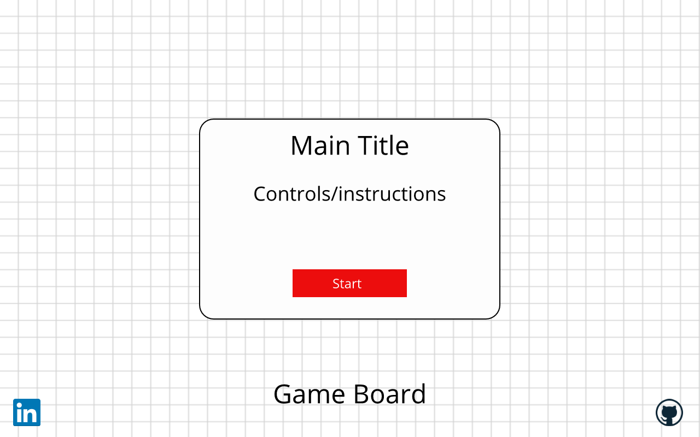

## Agar.io

### Background

Agar.io is a massively multiplayer online game originally designed and
created by Matheus Valadares.

It is a simple game not entirely different from the classic game "fishy".
The goal is to eat smaller cells and avoid being eaten by larger cells.

Some unique characteristics that set agar.io apart from fishy are:

1) Only a small portion of the game board is visible at a time
2) The player can choose to split their cell in half
3) Cells may eject mass
4) If a cell hits a "virus" and is too large, they will explode

The goal of this project is to create my own version of agar.io with
the featuers outlined below.

### Functionality & MVP

In this version of agar.io, players will be able to:

- [ ] Start the game
- [ ] Navigate their cell around the game board
- [ ] Eat smaller cells
- [ ] Be eaten by larger cells

This project will also include:

- [ ] A modal with the game's instructions and controls
- [ ] A link to my linkedin and github
- [ ] A production README

### Wireframes

The app will have a gameboard that is larger than the user's viewport.
The user will control their cell with their mouse by hovering their
cursor in the general direction they want to travel. The distance of
the cursor will affect the speed the cell travels at.

### Architecture & Technologies

This version of agar.io will be created using these technologies:

1) Vanilla `JavaScript` and `jquery` for structure and logic
2) `HTML5 Canvas` and `paper.js` for rendering
3) Webpack to bundle

There will be 5 scripts involved in the project:

`board.js`: handles creating the game board as well as the initial start
screen

`cell.js`: handles the logic for the cells as well as each cell's
attributes, such as `mass` and `color`.

`human_player.js`: handles human player mouse and keyboard inputs.

`computer_player.js`: takes care of NPC (non-playable cell) logic.

`food.js`: responsible for generating little bits of food that cells
can eat when they're not eating other cells.

### Implementation Timeline

**Day 1**: Setup necessary node modules, including webpack and paper.js.
Write `webpack.config.js`, `package.json`, a basic entry file, and
the skeletons for the above scripts. The main goal for the day:

- Render an object on the canvas

**Day 2**: Learn `paper.js` and write the `Board`, `Cell`, and
`Food` objects. Goals for the day:

- Render the starting screen
- Render the game board
- Render food on the board
- Render a cell

**Day 3**: Write `HumanPlayer` and `ComputerPlayer` classes. The API for
these classes should be identical. Goals for the day:

- Implement cell movement
- Get non-playable cells (NPCs) moving!
- Cells should be able to eat, grow, and be eaten

**Day 4**: Implement `ComputerPlayer` AI. The NPCs should follow smaller
cells within a certain radius and run from larger, nearby cells. Goals
for the day:

- Get `ComputerPlayer` AI working
- Generally polish app

### Bonus Features

- [ ] Allow cells to split
- [ ] Add a `Virus` class to the game
- [ ] Allow cells to eject mass
